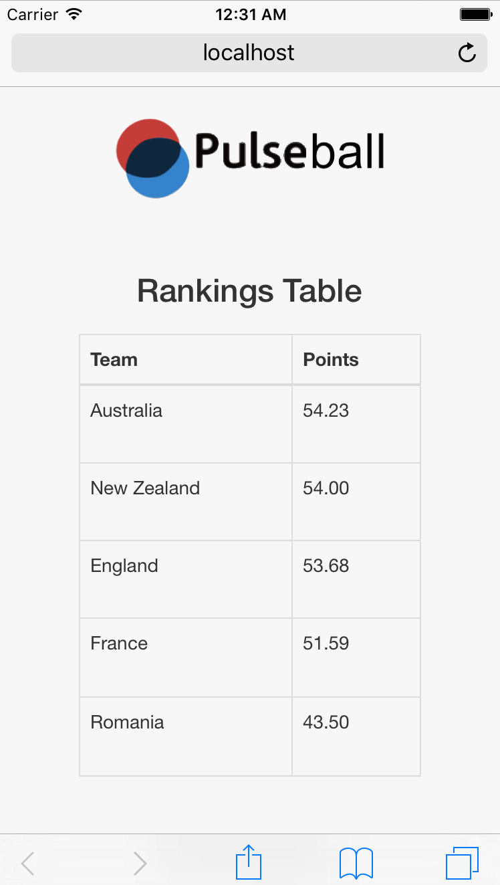

The app is a rankings predictor for the fictitious game of Pulseball.

Mobile Friendly

In the international game of Pulseball, various series and tournaments contribute to the overall ranking of the teams. Some games are played at home, some games are played away and some games (especially those at the tournament level) are played on neutral ground.
To calculate the number of points earned or lost by each team after a game, we first subtract the second team’s rating from the first’s. To suppress the advantage playing at home might give for the home team, its rating is temporarily increased by 3 points when performing the calculations.

Tech used: HTML, CSS (Bootstrap), JavaScript(Including JQuery for the manupulation of the DOM).