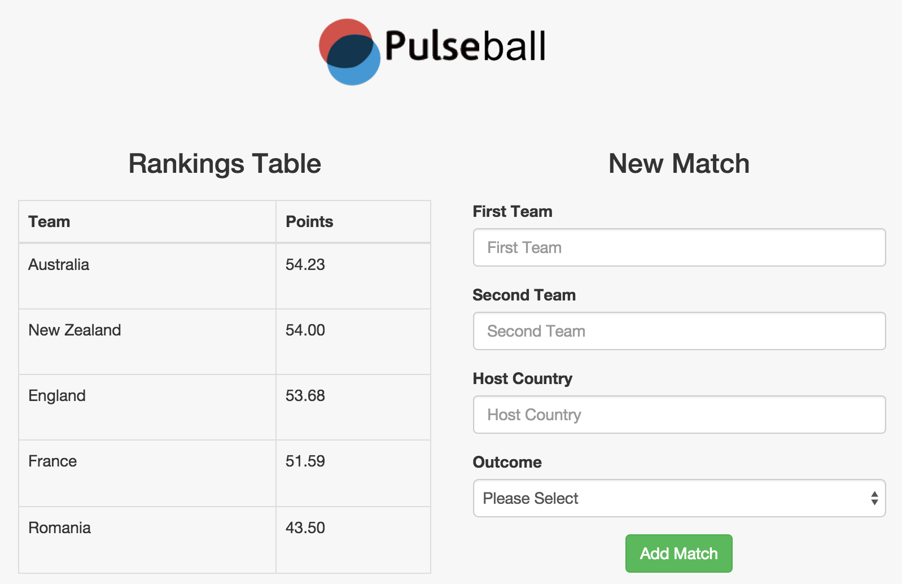
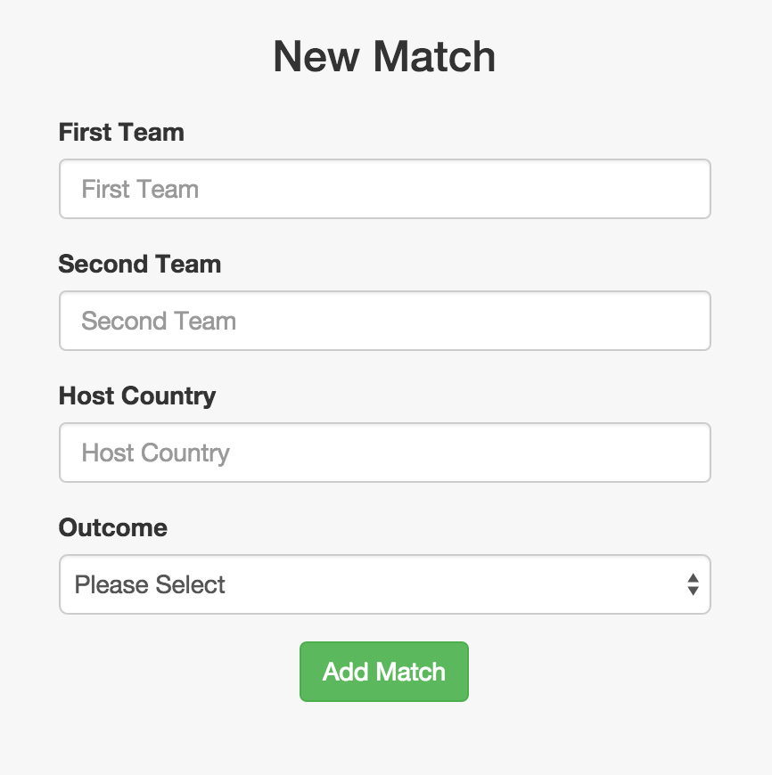

The app is a rankings predictor for the fictitious game of Pulseball.



In the international game of Pulseball, various series and tournaments contribute to the overall ranking of the teams. Some games are played at home, some games are played away and some games (especially those at the tournament level) are played on neutral ground.
To calculate the number of points earned or lost by each team after a game, we first subtract the second team’s rating from the first’s. To suppress the advantage playing at home might give for the home team, its rating is temporarily increased by 3 points when performing the calculations.
Tech used: HTML, CSS (Bootstrap), JavaScript(Including JQuery for the manupulation of the DOM).

## Installation
```
git clone git@github.com:Hassanmir92/pulseball.git
cd pulseball
open index.html
```
#### How it works
Once on the page you can see the current rankings of five national teams along with their points.

If on desktop the form to add a new match will be on your right as shown on the screenshot above - you may need to scroll down if on a mobile devise. You will need to choose the teams currently on the ranking tables. 



Once all fields have been added and submitted the rankings table will automatically update itself.